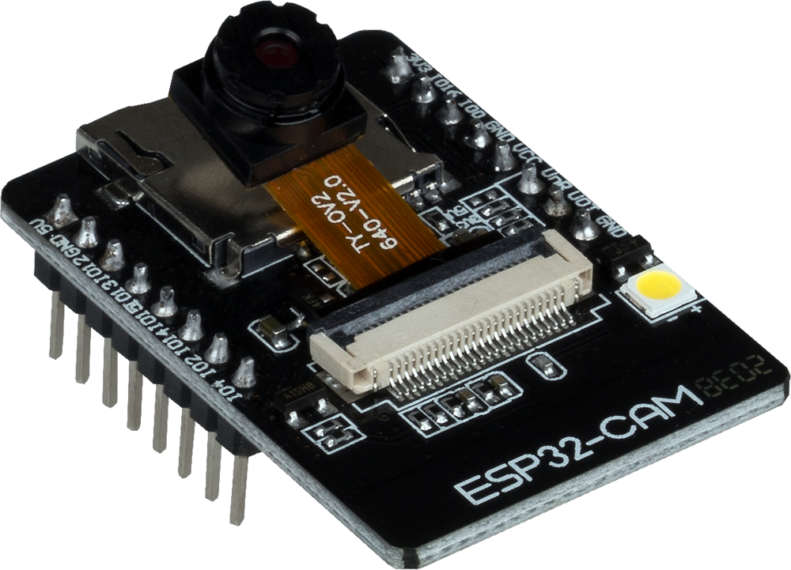
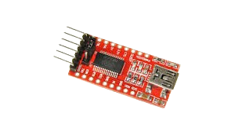

# FACE-RECOGNITION-WITH-SERIAL COMMUNICATION

## Project Title:

Interactive Robot with Python-based Face Recognition System

Co-authored by [Co-Author 1](https://github.com/chinmayeebl).

<figure>
  
  <figcaption>Physical Model for face recognition.</figcaption>
</figure>

https://github.com/rohitb-patil/FACE-RECOGNITION-WITH-SERIAL-COMMUNICATION/assets/143337294/11ca227c-7ad7-4e23-a08e-668cf8c1ff0b

# Project Description

This project combines three key components: 
1. **Facial Recognition Model Implementation**: We have developed a facial recognition model to identify individuals.
2. **ESP32 webcam integration** : Incorporation of ESP32-based webcams, enabling real-time video input for the facial recognition model.
3. **Python-Arduino Integration via Serial Communication**: Python scripts are interfaced with Arduino microcontrollers using serial communication, enabling seamless interaction between the two platforms.
4. **Peripheral Integration with Arduino**: Various peripherals such as LCD displays and servo motors are interfaced with Arduino, enhancing the functionality and capabilities of the system.

# Facerecognise.py

This Python script (`facerecognise.py`) provides functionality for face recognition utilizing OpenCV's face detection algorithms. It communicates with an Arduino board via serial communication to actuate peripherals based on the recognized faces.

## Requirements:
- Python 3 and above
- OpenCV
- pySerial
- Arduino board

---

# Arduino Serial Communication (arduinoserial)

This Arduino sketch (`arduinoserial`) is designed to receive commands from a Python script via serial communication and actuate peripherals connected to an Arduino Mega board accordingly.

## Requirements:
- Arduino IDE  version 2.0 and above
- Arduino Mega 2560 or other Arduino boards.

# ESP32 Webcam Integration
This file contains the initialization code for integrating ESP32-based webcams into the system. It ensures proper setup and communication between the Python script and the ESP32 devices.

 

Requirements:
- Arduino IDE  version 2.0 and above
- Arduino board and FT232 USB DRIVER.
- Compatible libraries and dependencies

